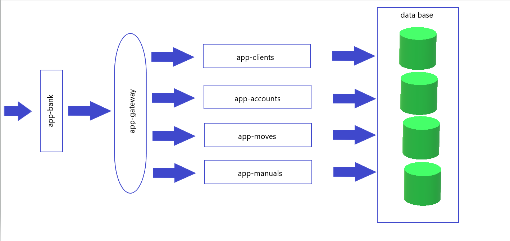
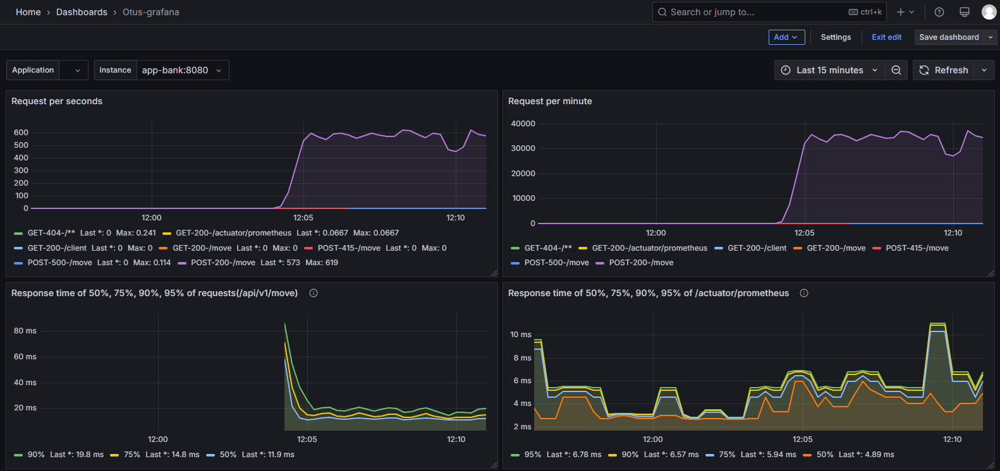
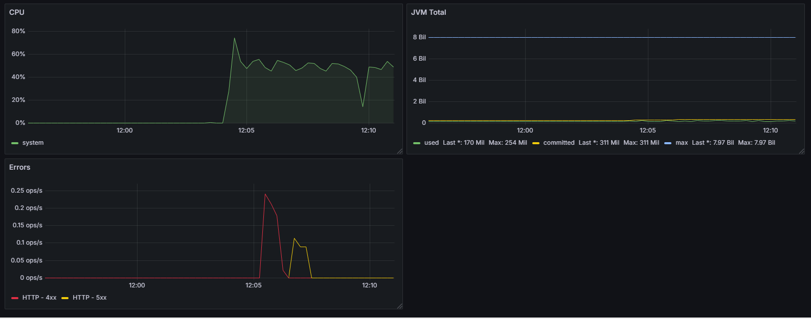

# Проектная работа

## Тема: «Прототип приложения банка/сервиса денежных переводов между клиентами»

## Описание

Прототип банковского приложения с реализацией механики внутрибанковских переводов между счетами клиентов.

#### Используемые модели данных:
   - Клиент
   - Счет
   - Движение по счету(платежный документ)
   - Денежный инструмент(валюта)

#### Основная функциональность:

Принимает `POST` запросы на переводы в `Json` формате: 

`{
"id": 0,
"accDt": "40817810400000000004",
"accKt": "40817810100000000001",
"docDate": [
2025,
5,
1
],
"sumDt": 1000.0,
"sumKt": 1000.0,
"description": "DDD -> AAA (RUB)"
}`

на:

`http://localhost:8080/api/v1/move`

`http://localhost:30000/api/v1/move` - для кубера

Проверяет реквизиты перевода на возможность проведения(номера счетов, наличие средств для списания).

Для мультивалютный переводов производится корнвертация по курсу, указанному в справочнике валют, 
который ежедневно обновляется заданием по расписанию.

### Структура проекта

   - bom
   - common
   - app-clients
   - app-accounts
   - app-moves
   - app-manuals
   - app-bank
   - app-gateway

#### bom
    
   *Конфигурационный модуль со списком зависимостей, используемых в проекте*

#### common

   *Библиотечный модуль, содержит общие объекты, зависимости*

#### app-clients

   *Сервис работы с клиентскими данными*

#### app-accounts

   *Сервис работы со счетами клиентов*

#### app-moves

   *Сервис работы с движениями по счетам(платежными документами)*

#### app-manuals

   *Сервис работы со справочными данными: список используемых валют*

#### app-bank

   *Основной сервис через который осуществляются денежные переводы между клиентами*

#### app-gateway

   *Сервис маршрутизации запросов*

#### БД
В качестве БД(СУБД) для сервисов используется **PostgreSQL**

Для миграции данных используется **Liquibase**

#### Схема

- deployment
- grafana
- jmeter
- postgres
- prometheus

#### deployment

*Скрипты для деплоя сервисов*

#### grafana

*Файлы конфигурации, деплоя/контейнеризации для Grafana*

#### jmeter

*Скрипты jmeter*

#### postgres

*Файлы для деплоя/контейнеризации БД*

#### prometheus

*Файлы конфигурации, деплоя/контейнеризации для Prometheus*

### Сборка

`cd bom`

`mvn clean package -DskipTests`

или

выполнить скрипт `build-images.bat`, 
при этом дополнительно создадутся images сервисов, включая БД, 
поднимется контейнер локального registry, в который запушаться созданные образы

### Запуск

`docker compose up -d`

для остановки

`docker compose down`

### Деплой

   Собрать образы и запушить в локальный `registry` контейнер, для этого выполнить `build-images.bat`

   **kubectl**
      
   Для запуска выполнить скрипт`deploy.bat`

   Для отката выполнить скрипт`delete-deploy.bat`

   **Helm**

   Для запуска выполнить скрипт`helm-deploy.bat`

   Для отката выполнить скрипт`helm-delete-deploy.bat`

### Реализовано

   1. Использование кэшей, для хранения справочных данных из БД(java.util.concurrent)

      [/app-bank/src/main/java/ru/otus/appbank/service/CurrencyService.java](./app-bank/src/main/java/ru/otus/appbank/service/CurrencyService.java)

   2. Подключен мониторинг приложений `spring boot actuator` с передачей в `prometheus`

   3. Настроено отображение метрик в `Grafana`

   4. Применены шаблоны отказоустойчивых сервисов

      [/app-bank/src/main/java/ru/otus/appbank/service/AccountService.java](./app-bank/src/main/java/ru/otus/appbank/service/AccountService.java)
      
      [/app-bank/src/main/java/ru/otus/appbank/service/ClientService.java](./app-bank/src/main/java/ru/otus/appbank/service/ClientService.java)
      
      [/app-bank/src/main/java/ru/otus/appbank/service/MoveService.java](./app-bank/src/main/java/ru/otus/appbank/service/MoveService.java)

   5. Использован планировщик задач
      
      [/app-bank/src/main/java/ru/otus/appbank/service/CurrencyService.java](./app-bank/src/main/java/ru/otus/appbank/service/CurrencyService.java)

   6. Подключен OpenApi(swagger)  
         
      [/app-accounts/src/main/java/ru/otus/appaccounts/controller/AccountController.java](./app-accounts/src/main/java/ru/otus/appaccounts/controller/AccountController.java)

      [/app-clients/src/main/java/ru/otus/appclients/controller/ClientController.java](./app-clients/src/main/java/ru/otus/appclients/controller/ClientController.java)

      [/app-moves/src/main/java/ru/otus/appmoves/controller/MoveController.java](./app-moves/src/main/java/ru/otus/appmoves/controller/MoveController.java)
      
      [/app-manuals/src/main/java/ru/otus/appmanuals/controller/CurrencyController.java](./app-manuals/src/main/java/ru/otus/appmanuals/controller/CurrencyController.java)

   7. Настроено развертывание приложения через `Helm`

      [/deployment/helm/templates/deployment.yaml](./deployment/helm/templates/deployment.yaml)

      [/deployment/helm/templates/service.yaml](./deployment/helm/templates/service.yaml)

      [/helm-deploy.bat](./helm-deploy.bat)

      [/helm-delete-deploy.bat](./helm-delete-deploy.bat)

   8. Для миграций используется `Liquibase`

      [/app-accounts/src/main/resources/application-dev.yml](./app-accounts/src/main/resources/application-dev.yml)

   9. Каждое приложение работает со своей схемой данных
